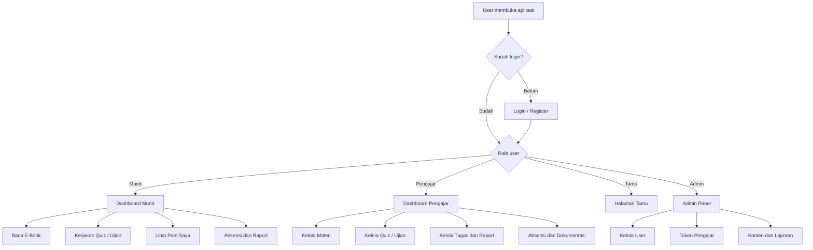
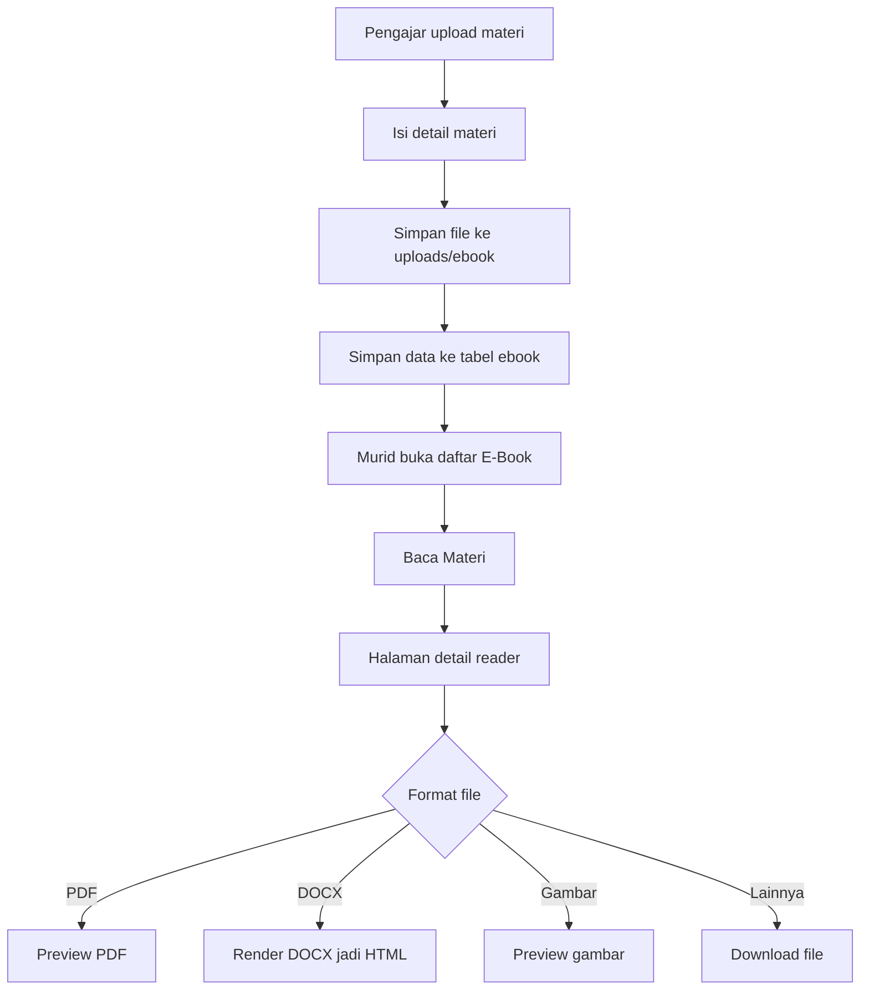
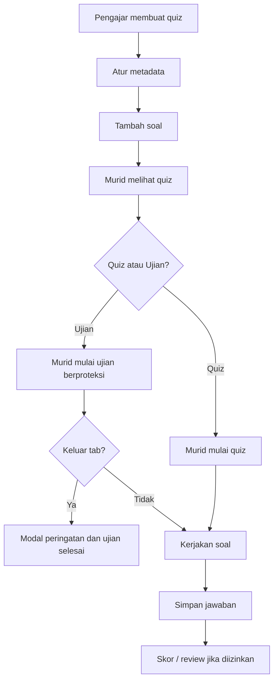
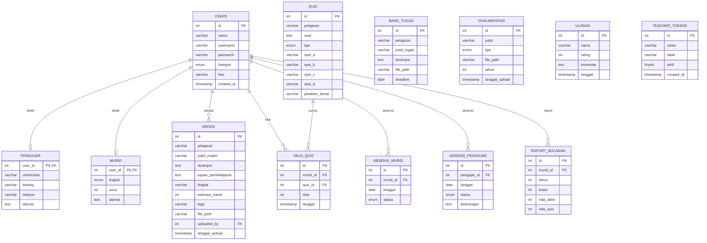

# Teach SKL

Teach SKL adalah aplikasi belajar untuk mengelola materi, quiz, tugas, absensi, raport, dokumentasi, dan admin panel dalam satu tempat. Project ini awalnya masih banyak memakai PHP klasik, lalu mulai dipindahkan ke frontend Next.js supaya tampilan dan alurnya lebih enak dipakai.

Stack utama:

- Frontend: Next.js, React, Tailwind CSS
- Backend: PHP native
- Database: MySQL
- Local server: XAMPP

---

## Fitur Utama

### Akun dan Role

Ada 4 role utama:

- **Murid**: membaca materi, mengerjakan quiz, melihat poin, absensi, raport, dan dokumentasi.
- **Pengajar**: upload materi, membuat quiz/ujian, mengelola tugas, absensi, raport, dan dokumentasi.
- **Tamu**: melihat dokumentasi dan memberi ulasan.
- **Admin**: mengelola user, token pengajar, konten, laporan, dan aktivitas sistem.

Pengajar saat daftar memakai token dari admin. Frontend juga menyimpan snapshot session agar halaman tidak terasa kosong saat refresh.

### E-Book / Materi

Pengajar bisa upload materi dengan detail tambahan:

- deskripsi,
- tujuan pembelajaran,
- tingkat materi,
- estimasi waktu belajar,
- tags,
- file materi.

Di sisi murid, daftar e-book tidak langsung menampilkan tombol download saja. Murid masuk dulu ke halaman detail reader, melihat konteks materinya, lalu bisa membaca preview atau download file.

Preview yang sudah didukung:

- PDF,
- DOCX,
- gambar.

Format lain tetap bisa diunduh walau belum bisa dipreview langsung di browser.

### Quiz dan Ujian

Pengajar bisa membuat quiz atau ujian dari halaman bank quiz. Metadata quiz saat ini masih disimpan di kolom `pelajaran` dengan format prefix khusus. Ini dipilih supaya tabel lama tetap bisa dipakai tanpa migrasi besar.

Yang bisa diatur:

- tipe quiz atau ujian,
- timer,
- deadline,
- jumlah percobaan,
- acak soal,
- tampilkan atau sembunyikan review hasil.

Untuk tipe **ujian**, jumlah percobaan selalu dipaksa 1 kali. Ujian juga punya proteksi tab. Kalau murid meninggalkan halaman ujian, sistem menampilkan modal peringatan dan ujian dihentikan.

### Poin

- Murid melihat halaman **Poin Saya**.
- Pengajar melihat ranking **Point Murid**.

### Modul Lain

- Bank tugas
- Absensi murid
- Absensi pengajar
- Raport
- Dokumentasi foto/video
- Ulasan tamu
- Admin panel

---

## Alur Singkat Aplikasi



## Alur E-Book



## Alur Quiz / Ujian



---

## Struktur Folder

```text
frontend/              Frontend Next.js yang dipakai sekarang
backend/               Endpoint PHP untuk data, action, upload, delete
config/                Koneksi database, CSRF, validation, logging
sql/                   Schema database
legacy/php-frontend/   UI PHP lama, disimpan sebagai fallback/arsip
```

Catatan lokal: folder kerja utama ada di repo ini. Folder XAMPP dipakai sebagai target deploy lokal. Beberapa perubahan perlu disalin ke XAMPP kalau menjalankan dari Apache lokal.

---

## ERD Database



---

## Route yang Sering Dipakai

Beberapa endpoint masih memakai clean route, beberapa sengaja dipanggil langsung ke file PHP agar stabil di XAMPP.

Contoh route data:

- `backend/data/ebooks`
- `backend/data/quizzes`
- `backend/data/ranking`
- `backend/data/raport`
- `backend/data/dokumentasi`

Contoh direct endpoint yang dipakai frontend modern:

- `backend/uploads/upload_ebook.php`
- `backend/actions/update_ebook.php`
- `backend/deletes/hapus_ebook.php`
- `backend/actions/tambah_quiz.php`
- `backend/actions/update_quiz.php`
- `backend/actions/rename_quiz_subject.php`
- `backend/actions/jawab_quiz.php`
- `backend/deletes/hapus_quiz.php`

---

## Menjalankan Project

### 1. Frontend

```powershell
cd frontend
npm install
npm run dev
```

Buka:

```text
http://localhost:3000
```

### 2. Backend

Jalankan Apache dan MySQL dari XAMPP. Untuk setup lokal saat ini, deploy XAMPP biasa diarahkan ke:

```text
C:\xampp\htdocs\moodle\public\tech-skl-deploy
```

### 3. Database

Import schema:

```text
sql/tech_skl.sql
```

Konfigurasi database ada di:

```text
config/database.php
```

Default lokal:

- database: `tech_skl`
- user: `root`
- password: kosong

---

## Catatan Pengembangan

Beberapa hal yang masih perlu dirapikan nanti:

- source of truth perlu dibuat lebih tegas antara repo dan folder XAMPP,
- file legacy masih ada dan beberapa masih masuk lint XAMPP,
- metadata quiz advanced masih menumpang di string `pelajaran`,
- sebaiknya nanti metadata quiz dipindah ke kolom database sendiri,
- perlu script deploy/sync otomatis ke XAMPP agar tidak copy manual.

---

## File Penting

- `frontend/src/app/page.tsx`
- `frontend/src/components/pages/EbookPage.tsx`
- `frontend/src/components/pages/QuizPage.tsx`
- `frontend/src/components/pages/QuizEditorTeacher.tsx`
- `frontend/src/components/pages/PointMuridPage.tsx`
- `frontend/src/components/ui/AppDialog.tsx`
- `frontend/src/components/ui/FileReader.tsx`
- `backend/index.php`
- `backend/uploads/upload_ebook.php`
- `backend/actions/update_ebook.php`
- `backend/actions/tambah_quiz.php`
- `backend/actions/update_quiz.php`
- `backend/data/get_ranking.php`
- `sql/tech_skl.sql`

---

## Status Singkat

Untuk kebutuhan demo lokal, fitur utama sudah bisa dipakai. Bagian yang paling penting sekarang adalah menjaga sinkronisasi antara repo utama dan folder XAMPP, karena environment lokal project ini masih menggunakan keduanya.
